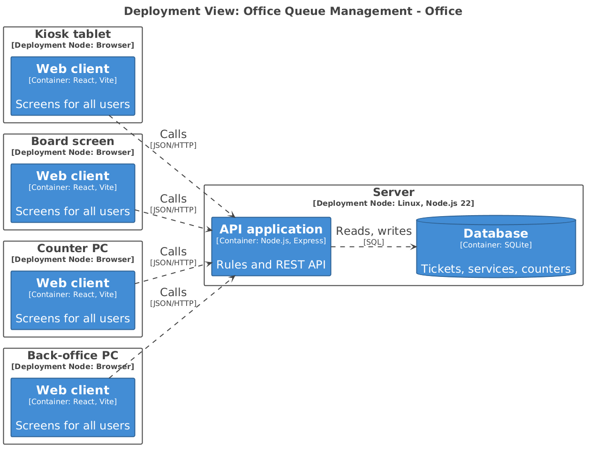
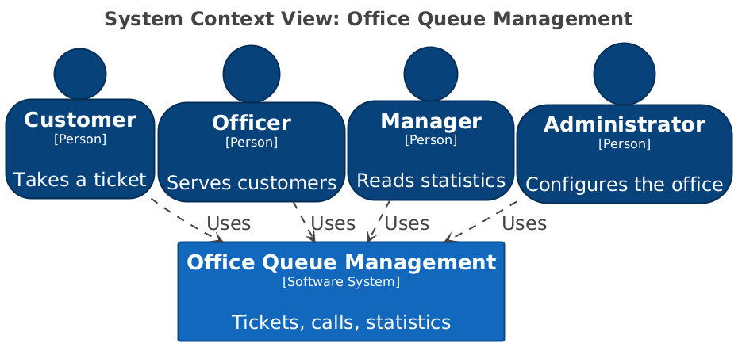
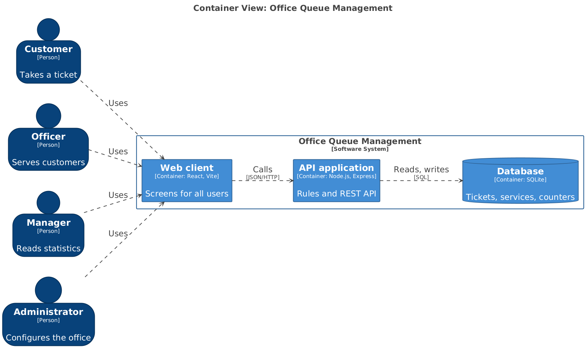
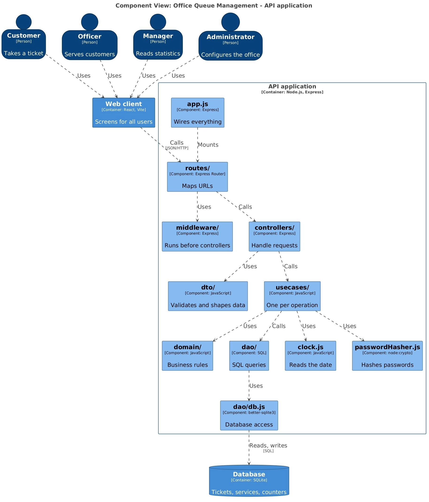
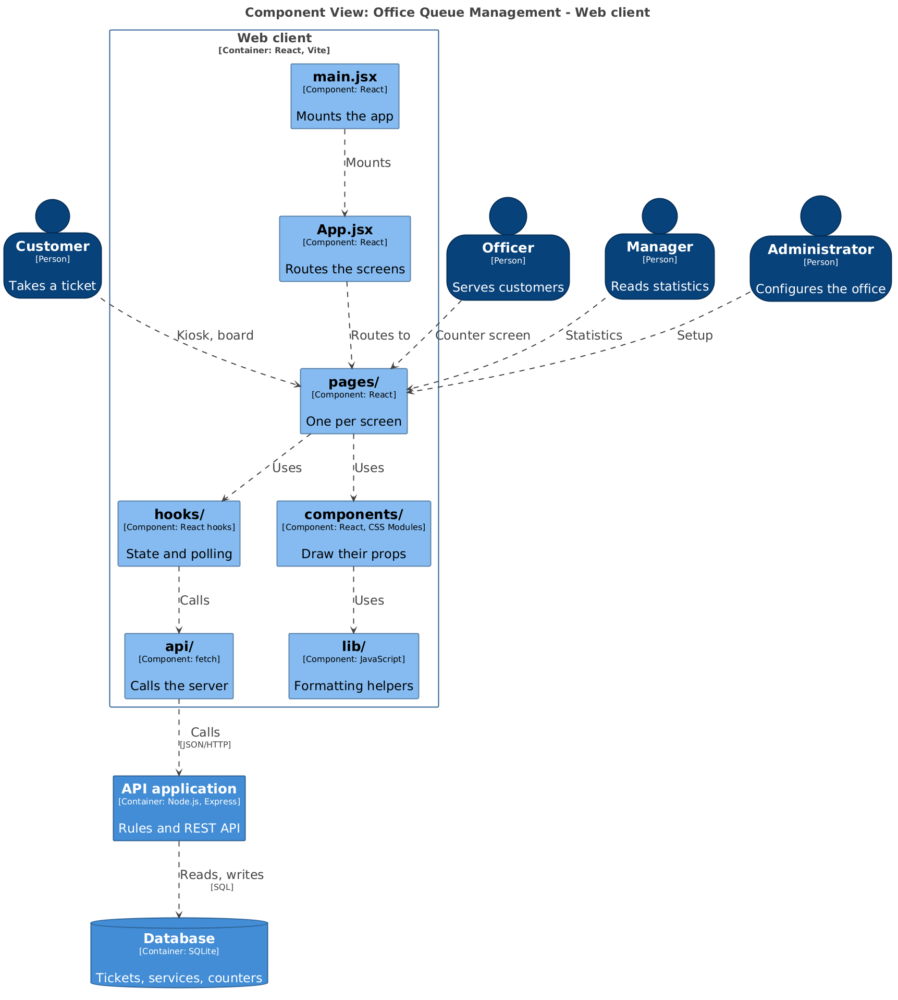

# Office Queue Management — Architecture

## 1. The physical system

- **Four kinds of device in the office**, all running only a web browser, with nothing to install: the *kiosk tablet* (customers take a ticket and see the wait), the *board screen* (queues and calls, refreshes itself), the *counter PCs* (one per counter, used by the officers) and the *back-office PC* (manager and administrator).
- **One server** runs a single Node.js process, which serves the API and the built web client, and keeps the SQLite file on a persistent disk. It can be a small machine in the office or a cloud virtual machine: this choice is still open.

## 3. System context (C4 level 1)

Four kinds of people use one system. The system has **no external dependencies**: no email, no SMS, no third-party service.

## 4. Containers (C4 level 2)

- **Web client**: a React single-page application.
- **API application**: Node.js and Express. It holds all the business rules and also serves the built web client.
- **Database**: SQLite, one file.

## 5. Backend

### Layers and the one rule

| Folder | Role | May import |
|---|---|---|
| `domain/` | Pure business rules and domain errors | nothing |
| `usecases/` | One function per operation: orchestrates dao, domain, clock and password hasher | `domain/` only |
| `dao/` | All the SQL; `db.js` is the only file that knows the driver | `db.js` only |
| `dto/` | Validates the input, shapes the output | `domain/errors.js` only |
| `controllers/` | HTTP adapter: reads the request, calls one use case, chooses the status code | `dto/` only |
| `routes/` | Maps URLs to controllers, and puts the middleware in front of the ones that need it | `express` only |
| `middleware/` | Code that runs before the controllers; for now, finding out who is calling | nothing: what it needs is handed over |
| `app.js` | Builds every piece and wires them together | everything |
| `clock.js`, `index.js` | The only reader of the date; the server start | nothing; `app.js` |
| `passwordHasher.js` | The only place that hashes and checks passwords | nothing |

**The rule: source-code dependencies point inward, towards the core.** A use case does not import the dao: `app.js` hands it over as a parameter, and likewise for the clock, the password hasher, the controllers, the middleware and the routers. ESLint fails the build on any other import. The diagram above shows who *calls* whom at runtime; the table shows who may *import* whom.

### EXAMPLE A request, start to finish: `POST /api/tickets`

1. The route sends the request to the controller.
2. The controller validates the body with the DTO (invalid input: `400`) and calls the use case.
3. The use case asks the dao which counters serve the service (none: `422`), inserts the ticket, counts the tickets ahead, and asks the domain for the waiting time.
4. The controller shapes the answer: `201 { "code": "SHIP-007", "estimatedWaitSec": 950 }`.
5. Domain errors are turned into `400`, `409` or `422` by one middleware in `app.js`; anything else is a `500`.

### Authentication

Only the officer's endpoints need a login. The customer never logs in, so `GET /api/services` and `POST /api/tickets` stay public. The login is a server-side session: a random id, stored in the database and sent to the browser in a cookie.

| Piece | Where | What it does |
|---|---|---|
| `UnauthorizedError` (401), `ForbiddenError` (403) | `domain/errors.js` | Two new error classes; the middleware in `app.js` turns them into status codes |
| `login`, `logout`, `authenticate` | `usecases/` | Check the credentials and create or delete the session; given a session id, return the user or fail with `401`. Who may do what (only an officer calls the next customer) is checked here, on the user the controller hands over |
| `users`, `sessions` | `dao/` | Find a user by name; create, find and delete a session |
| `parseLogin`, `toUserDto` | `dto/` | Validates username and password; shapes the user without the password hash |
| Login and logout controllers | `controllers/` | Call the use case, then set or clear the cookie (`HttpOnly`, `SameSite=Lax`). The cookie is an HTTP detail, so it never reaches a use case |
| `requireAuth` | `middleware/` | Reads the cookie, asks `authenticate` who is calling and puts the user in `req.user` |
| `POST /api/sessions`, `DELETE /api/sessions` | `routes/` | Login and logout |
| `passwordHasher.js` | `src/` | `hash` and `verify`; the only file that knows the algorithm |

**Login.** The controller validates the body with the DTO. The `login` use case reads the user from the dao, asks the password hasher to check the password and creates the session. The controller sets the cookie and answers `201`; wrong credentials give `401`.

**A protected request.** The router puts `requireAuth` in front of the controller of that path. `requireAuth` reads the cookie and asks `authenticate`: an unknown session gives `401` and the controller never runs. Otherwise `req.user` is set, the controller passes the user to the use case as a plain argument, and the use case answers `403` if the role is not allowed.

Why it is built this way:

- **The router decides what is protected.** One line in the router shows which endpoints need a login, and the public ones are never touched. No controller has to be read to find out.
- **`requireAuth` only answers "who is calling?"** Who may do what is a business rule, so it stays in the use case.
- **A session, not a token.** `DELETE /api/sessions` really ends the login, because the server forgets the session id. A signed token could not be revoked.
- **Hashing is technology, so it is handed over like the clock.** A test passes a fake that does no calculation, and changing the algorithm means changing one file.

### Why it is built this way

- **The rules are the risk, so they are the easiest thing to test.** `domain/` has plain functions: the worked example of the specification (15:50) is a one-line test.
- **It follows clean architecture principles**, which makes the system easier to change.
- **The database is replaceable in one place.** Only `db.js` imports the driver. A different database means rewriting that file and the dialect-specific SQL; an asynchronous driver would also add `await` in the use cases.
- **Time is injected.** Only `clock.js` reads the date, so a test can fix the day. The daily reset of the queues needs no scheduled job: every ticket carries its day.
- **People can work in parallel.** A story adds files in its own resource; `app.js` is the only shared file.

## 6. Frontend

| Folder | Role | May import |
|---|---|---|
| `pages/` | One screen per route: Kiosk, Officer, Board, Manager, Admin | `hooks/`, `components/` |
| `hooks/` | State, loading and error, polling | `api/`, `lib/` |
| `components/` | Reusable pieces that draw their props; styles in CSS Modules | `lib/` |
| `api/` | The only place that calls the server: one function per endpoint | nothing |
| `lib/` | Pure formatting helpers (950 seconds → `15:50`) | nothing |

**EXAMPLE: A screen, start to finish (the kiosk).** `KioskPage` calls `useServices`, which asks `api/` for the services every few seconds. `ServiceCard` draws each queue and its wait. A click calls `useIssueTicket`, which posts to the server and shows the ticket code.

### Why it is built this way

- **The client has no business rules.** The server decides who is called and how long the wait is; the client only shows it.
- **One place talks to the server.** If an endpoint changes, only `api/` changes, and ESLint forbids `fetch` anywhere else.
- **Components are easy to test.** They receive props and emit events, so a test renders them with no server.
